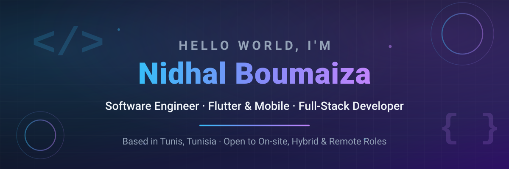

  

  

---

### 👨‍💻 About Me

I'm **Nidhal Boumaiza**, a **Software Engineer** (Engineering degree in Software Engineering, Iteam University) who builds mobile and web products end to end — from polished frontends to solid, real-time backends and cloud deployments.

- 🚀 **Shipping to the stores:** I designed, built, and published **[Barberio](https://apps.apple.com/us/app/barberio/id6761790714)** on the **App Store** and **[Google Play](https://play.google.com/store/apps/details?id=io.barberio.app)** under my own developer account.
- 📱 **Client work:** Since September 2025, I've been a Flutter mobile developer on a remote contract with **AL Manarah Advanced Company** (Saudi Arabia), building **[Maqra'at Al-Rajhi](https://play.google.com/store/apps/details?id=com.manara.maqari)** with low-latency live audio streaming, available on both stores.
- 🎓 **Graduation project (PFE):** At **eSteps Health**, I engineered the **CIRO** smart restaurant platform — 3 Flutter apps (client, kiosk, rider), a Laravel 12 backend with real-time WebSockets (Reverb), a Next.js 16 admin back office, and SCADA robotic supervision, containerized with Docker.
- 🌍 **Trilingual:** Arabic (native), French (fluent), English (professional).
- 📫 **Reach me at:** **[nidhal.boumaiza@outlook.com](mailto:nidhal.boumaiza@outlook.com)**

---

### 🛠️ Tech Stack

  
  
  
  
  
  
  
  
  
  
  
  
  
  
  
  
  
  
  
  
  
  

---

### 🚀 Featured Work

| Project | What it is | Stack | Status |
| --- | --- | --- | --- |
| **Barberio** | Barber and salon booking app for clients, barbers, and salon owners: bookings, reminders, reviews, portfolios, team and schedule management. | Flutter · Firebase | **Published** — [App Store](https://apps.apple.com/us/app/barberio/id6761790714) · [Google Play](https://play.google.com/store/apps/details?id=io.barberio.app) |
| **Maqra'at Al-Rajhi** | Quranic educational platform for AL Manarah Advanced Co: live audio recitation sessions, teacher–student scheduling, push notifications, Arabic RTL. | Flutter · BLoC · REST APIs | **Client app, published** — [App Store](https://apps.apple.com/sa/app/id6753659959) · [Google Play](https://play.google.com/store/apps/details?id=com.manara.maqari) |
| **CIRO Pizza Platform** | Graduation project at eSteps Health: customer app, kiosk and rider apps, real-time order sync, admin back office, and SCADA robotic supervision. | Flutter · Laravel 12 · Reverb · Next.js 16 · Docker | Engineering PFE (private repo) |
| [**E-Santé Platform**](https://github.com/nidhalboumaiza-0/PFA_2026_E-Sante) | Healthcare platform for patients, doctors, and admins, built as Node.js services behind an API gateway. | Flutter · Next.js · Node.js · MongoDB · Redis · Kafka · Docker | Academic project (PFA) |
| [**HajMoto**](https://github.com/nidhalboumaiza-0/HajMoto) | Inventory, sales, and PDF invoicing for a motorcycle-parts shop, with an offline demo mode. | Flutter · BLoC · Supabase · Docker | Freelance project |
| [**Bus Tracking**](https://github.com/nidhalboumaiza-0/bus-tracking) | Shuttle planning and monthly bus-trip accounting with role-based access for the requester, the transport operator, and admins. | Next.js · TypeScript · Prisma · MySQL · NextAuth | Web application |
| [**AASD Medical Platform**](https://github.com/nidhalboumaiza-0/aasd-medical-platform) | Appointments, consultations, and real-time patient–doctor messaging. One-command Docker demo. | React · Express · MongoDB · Socket.IO · Docker | Academic project |
| [**Gaspino**](https://github.com/nidhalboumaiza-0/gaspino) | Anti-food-waste app with location-aware product discovery on a map. | Flutter · Google Maps · Node.js · MongoDB | Freelance project |
| [**Biblio Library Platform**](https://github.com/nidhalboumaiza-0/biblio-library-platform) | Books, authors, loans, and returns with seeded demo accounts. | React · Flask · MariaDB · Docker | Academic project |
| [**TeamFlow**](https://github.com/nidhalboumaiza-0/PFA-Team-Managment) | Team, task, and equipment management dashboard. | React · TypeScript · Express · MongoDB | Academic project |

Screenshots and details for all projects are on my **[Portfolio](https://nidhal-portfolio.vercel.app/)**.

---

### 📊 GitHub Stats

  
  

  

---

### 🐍 Contribution Snake

  

---

### 🤝 Let's Connect

  
  
  
  
  

  

